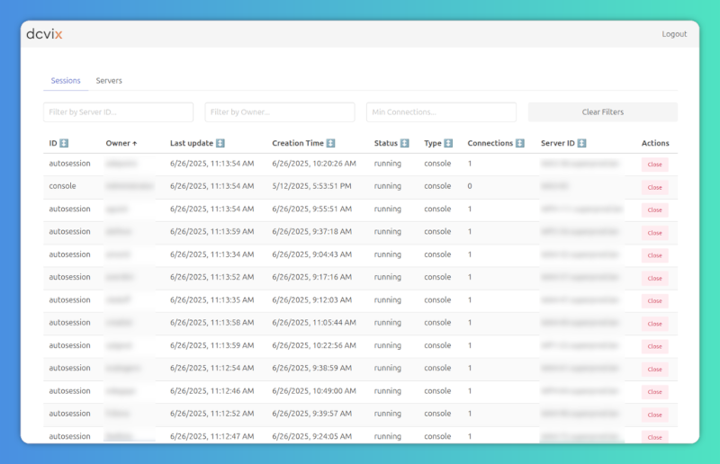

> [!WARNING]
> This project is a work in progress. It is advised that you do not use this in production
> unless you are willing to encounter bugs, papercuts or your computer on fire along the way.

  

dcvix is a session broker and server-pool manager for Amazon DCV. It provides centralized authentication, desktop session lifecycle management, and automatic allocation of DCV servers.
It consists of three components:
- The **director** runs on a central server and allows administrators to control desktop access and user authentication. It also acts as a token authenticator.
- The **agent** runs on workstations, collecting statistics and session information to be sent to the director. It responds to requests for session creation and termination.
- The **launcher** runs on the user's computer with a GUI. It authenticates users to obtain a security token, displays a list of DCV servers available to the user, and launches the DCV viewer.

dcvix Director
===========

The management service for the dcvix orchestrator, manages and monitors Amazon DCV servers and sessions.

Built with Go and a React frontend.

Full documentation is available at **[docs site](https://dcvix.github.io/)**.
